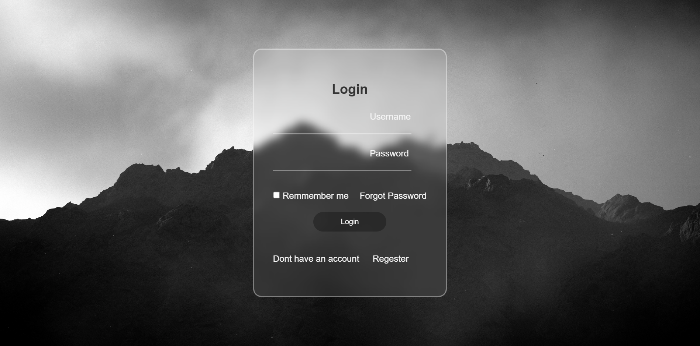

# ✨ Glassmorphism Login Page

Hey there! 👋 Welcome to my login page project. I built this because I wanted to create something that looks modern, feels smooth, and is actually pleasant to use. You know those login forms that just feel... boring? Well, I tried to make this one different!

## 📸 What It Looks Like

*[Hey! Place your login page screenshot here - just take a screenshot of your form and name it "login-screenshot.png" in your project folder]*



## 🎯 What's This All About?

This is a simple but stylish login/signup page I created while learning front-end development. It's got that trendy "glass morphism" effect (you know, that frosted glass look that's everywhere now) and some smooth hover effects that make it feel alive.

## ✨ Cool Stuff It Can Do

- **That Frosted Glass Look** - The form has that transparent, blurry background that looks like glass
- **Smooth Animations** - Buttons and links change color smoothly when you hover over them
- **Clean & Simple** - No clutter, just what you need to log in
- **Works Everywhere** - It's centered perfectly on any screen (I tested it, promise! 😊)

## 🛠️ What I Used

- Just good old HTML and CSS (nothing fancy!)
- Poppins font from Google Fonts (it's my favorite - so clean!)
- Lots of trying, failing, and trying again

## 🚀 Want to Use It?

Super easy! Here's how:

1. Grab all the files from this repo
2. Find a cool background image you like and name it `background.png`
3. Drop it in the same folder as the HTML file
4. Double-click the HTML file and voilà! 🎉

## 🎨 Make It Your Own

Feel free to tweak things! Here's how:

### Change Colors
Look for these lines in the CSS and play with the numbers:
```css
background: rgba(255, 255, 255, 0.089);  /* Less = more transparent */
color: rgba(255, 255, 255, 0.363);        /* Changes text color */
